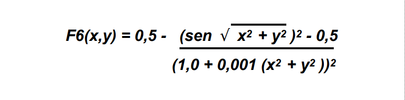

<h1 align="center">
  Computational Intelligence
</h1>
<p align="center">
    
    
</p>

## Development of a Genetic Algorithm to maximize the F6 function



## Requirements

```
$ go version
go version go1.16.6
```

## Getting Started

### Instalation

Run the following command to download the modules:

 ```
 $ go mod download
 ```

### Usage

Start the project with the default parameters:

 ```
 $ go run cmd/f6-implementation/main.go
 ```

You can also customize a few parameters. In order to show them you can run:

```
$ go run cmd/f6-implementation/main.go -h
Usage of path\to\main.exe:
   -b int
        The chromosome bits size (default 44)
  -c float
        The crossover rate (default 0.65)
  -g int
        The maximum number of generations (default 40)
  -m float
        The mutation rate (default 0.008)
  -max float
        The domain maximum (default 100)
  -min float
        The domain minimum (default -100)
  -p int
        The population size (default 100)
```

### Building the Project

You are able to build the project by running:

 ```
 $ go build -o f6-implementation.exe cmd/f6-implementation/main.go
 ```

This will compile the project into an executable named `f6-implementation.exe`.

### Formatting the Project

To keep golang format style run the following:

 ```
 $ gofmt -l -s -w .
 ```

---

> **Student**: João Vitor Almeida de Oliveira
>
> **E-mail**: joao.almeida200@discente.ufg.br
